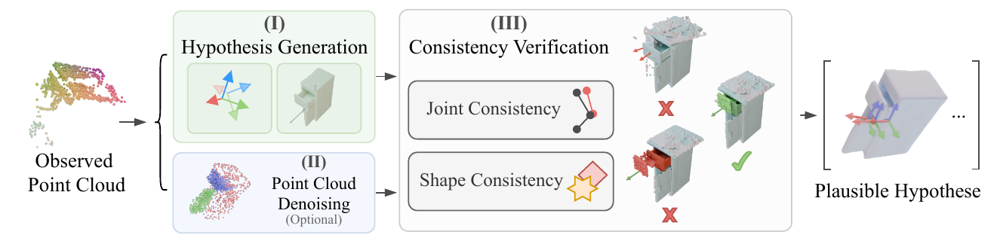
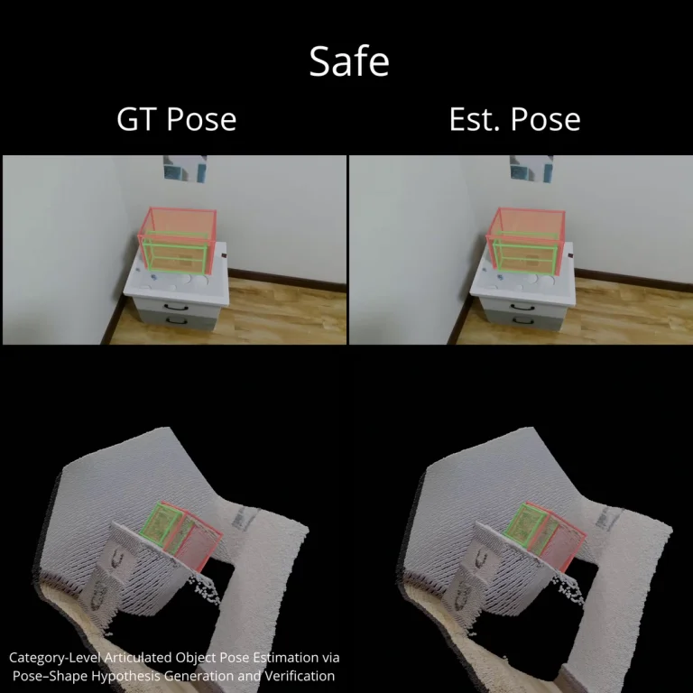

# Category-Level Articulated Object Pose Estimation via Pose-Shape Hypothesis Generation and Verification

Kaifeng Tang · Chi Xu* · Xin Ao · Yuting Ge · Tingrui Guo · Jun Zhou

China University of Geosciences, Wuhan

**ECCV 2026**

[](https://link.springer.com/chapter/10.1007/978-3-032-37553-7_5)

## Overview



Given a single-view point-cloud observation, our framework generates a set of coupled pose-shape hypotheses, recovers clean part-level geometry when needed, and verifies each hypothesis using joint and shape consistency. The final output retains geometrically plausible pose-shape pairs instead of collapsing occlusion-induced ambiguity into a single prediction.

## Demo




## Highlights

- **Joint pose-shape generation:** models entangled pose and shape uncertainty and samples paired hypotheses from a shared condition.
- **Part-level denoising:** completes and cleans partial real-world point clouds before verification.
- **Explicit geometric verification:** combines joint consistency with an SDF-based cross-space shape score to prune implausible hypotheses.
- **Single-view inference:** estimates per-part 6D poses and canonical object shape from one partial point-cloud observation.


## Installation and Usage

For environment setup, dataset preparation, training, and evaluation instructions, see the [Installation and Setup Guide](./install.md).

## Citation

```bibtex
@InProceedings{10.1007/978-3-032-37553-7_5,
  author    = {Tang, Kaifeng and Xu, Chi and Ao, Xin and Ge, Yuting and Guo, Tingrui and Zhou, Jun},
  title     = {Category-Level Articulated Object Pose Estimation via Pose-Shape Hypothesis Generation and Verification},
  booktitle = {Computer Vision -- ECCV 2026},
  year      = {2026},
  publisher = {Springer Nature Switzerland},
  address   = {Cham},
  pages     = {74--92}
}
```

## Third-Party Software

This repository includes vendored and locally modified source code from the following projects:

- [Mamba v1.1.1](https://github.com/state-spaces/mamba/tree/v1.1.1), licensed under Apache-2.0.
- [causal-conv1d v1.1.1](https://github.com/Dao-AILab/causal-conv1d/tree/v1.1.1), licensed under BSD-3-Clause.
- [Pointnet2_PyTorch](https://github.com/erikwijmans/Pointnet2_PyTorch), released under the Unlicense.
- [KNN_CUDA](https://github.com/unlimblue/KNN_CUDA).

License files supplied by the upstream projects are retained in their corresponding vendored source directories. The vendored Mamba source includes local CUDA compatibility updates that replace deprecated CUB calls and remove the legacy `sm_70` build target. Pointnet2_PyTorch also includes local build compatibility updates.

## Acknowledgements

We thank the authors of HOI4D, ANCSH, OMAD, RPF, PPF-Tracker, PointAttN and other related open-source projects for their valuable contributions.

This work was supported by the National Natural Science Foundation of China under Grant No. 62273318 and, in part, by the Major Program of Xiangjiang Laboratory under Grant No. 25XJJB01.
